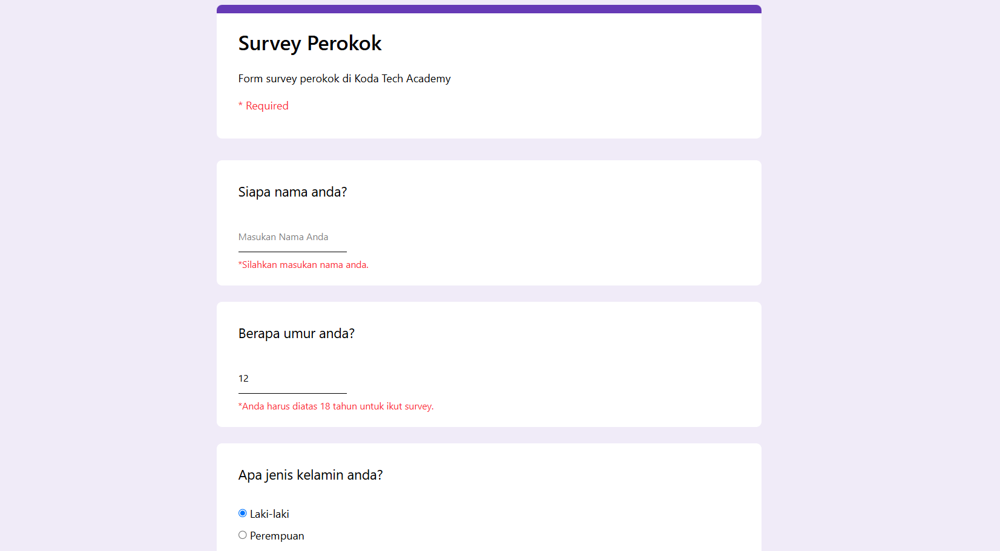
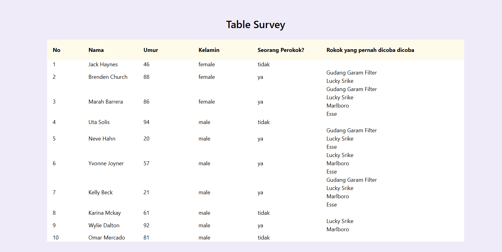

# Clone Form Google

Program form survery perokok dengan tampilan google form, untuk penangani masalah submission pada form, program ini menggunakan react hook form dan yup untuk validasinya

## Tech Stacks:
- React Js v19.x.x
- TailwindCss v4.x.x
- Vite v8.x.x

## Schema validasi Yup:

```jsx
const schemaValidation = yup.object({
	name: 
	yup.string().required("Silahkan masukan nama anda.").min(3, "Nama anda terlalu pendek."),
	age: 
	yup.number().required("Silahkan masukan umur anda").positive().integer().min(18, "Anda harus diatas 18 tahun untuk ikut survey."),
	gender: 
	yup.string().required("Silahkan pilih kelamin anda"),
	smoker: 
	yup.string().required("Silahkan konfirmasi apakah anda seorang perokok"),
})

```
## Watching input form & manually set Error:
```js
// watching input
const [cigarete, smoker] = watch(["cigarete", "smoker"])
  
useEffect(() => {
	if(smoker === "ya" && !cigarete) setError("cigarete 
	{type:"manual", message:"Silahkan pilih rokok."})
	else clearErrors("cigarete")

},[watch, smoker, clearErrors, cigarete, setError])
```

### Customs Hook:
```js
export default function useSurvey(){
	const [data, setData] = 
	useState(JSON.parse(window?.localStorage?.getItem("surveys")))

	return [data, (data) => {
		setData((prev) => {
			return [
			...prev,
			data
		]})
	}]
}
```

### Submit handler:

```js
function onSubmitSurvey(e){
  try{
    const formData = {}
    let surveys = []
    if(smoker === "ya" && !cigarete.length){ // checking algorithm's flow 
        setError("cigarete", {type:"manual", message:"Silahkan pilih rokok"})
    }
      
    for (const props in e){
      formData[props] = e[props]
    }
  
    const surveysData = JSON.parse(window.localStorage.getItem("surveys"))
    if(surveysData){
      surveys = [...surveysData]
    }
    surveys.push(formData)
    setData(surveys)  // set new data to the useSurvey's setter
    window.localStorage.setItem("surveys", JSON.stringify(surveys))
    
    //navigate to list page
    window.location.href = "/list"
  } catch(err){
    console.error(err.message)
   }
}

```
### Preview Demo:

Form Page


Table Page:
